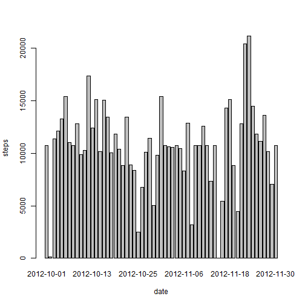
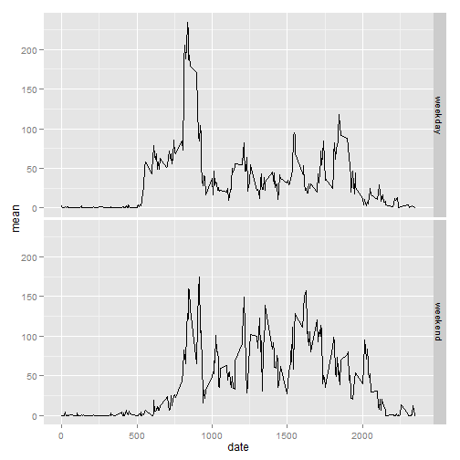

Reproducible Research - Peer Assignment 1
=====
by Sudhakar Ramamurthy
github repo with RMarkdown source code:
https://github.com/sudhakarramamurthy/RepData_PeerAssessment1

# Goal
The goal of this assignment is to find patterns from the data that are caputured using personal activity monitoring devices and address a set of questions pretaining to the same.

## 1. Loading and preprocessing the data
Since the data format of the column are known, we can load the data specfiying the col data types as defined in the problem statement.

```r
unzip("activity.zip")
activity <-  read.csv("activity.csv" , header=TRUE ,  colClasses = c("numeric", "Date", "numeric"))
```

## 2. What is mean total number of steps taken per day?

### Make a histogram of the total number of steps taken each day

The above requires us to sum the steps by date on activity data set, since the problem requires us to ignore the missing values in the dataset, we are adding na.rm=TRUE in the aggregation.


```r
totalStepsTakenPerDay = aggregate(steps ~ date, data = activity, FUN = sum)
colnames(totalStepsTakenPerDay) <- c("date","steps")
barplot(totalStepsTakenPerDay$steps, names.arg=totalStepsTakenPerDay$date, xlab="date", ylab="steps")
```

 

### Calculate and report the mean and median total number of steps taken per day


```r
mean(totalStepsTakenPerDay$steps , na.rm = TRUE)
```

```
## [1] 10766
```


```r
median(totalStepsTakenPerDay$steps , na.rm = TRUE)
```

```
## [1] 10765
```

## 3. What is the average daily activity pattern?

### Make a time series plot (i.e. type = "l") of the 5-minute interval (x-axis) and the average number of steps taken, averaged across all days (y-axis)

To address this question we are taking the mean of steps by Interval and will do a plot with type "l" as required.


```r
avgStepsIntervalWise = aggregate(activity$steps, by=list(activity$interval), mean, na.rm=TRUE)
colnames(avgStepsIntervalWise) <- c("interval","steps")
plot(avgStepsIntervalWise, type="l")
```

 


### Which 5-minute interval, on average across all the days in the dataset, contains the maximum number of steps?


```r
avgStepsIntervalWise$Interval[which.max(avgStepsIntervalWise$steps)]
```

```
## NULL
```

## 4. Imputing missing values

### Calculate and report the total number of missing values in the dataset (i.e. the total number of rows with NAs)


```r
sum(is.na(activity))
```

```
## [1] 2304
```

### Devise a strategy for filling in all of the missing values in the dataset.
For this I have decided to fill the steps NA with value of mean for that day computed in the eariler question and collected on the data set avgStepsIntervalWise


### Create a new dataset that is equal to the original dataset but with the missing data filled in.

Creating a new data set activityNew in which all the NA will be substituted with mean

```r
activityNew <- merge(activity, avgStepsIntervalWise, by = "interval", suffixes = c("",".mean"))
activityNew$steps = ifelse(is.na(activityNew$steps), activityNew$steps.mean, activityNew$steps)
```

I reconfirm now that the data set activity now does not have any NA values


```r
# this should now return me a 0
sum(is.na(activityNew))
```

```
## [1] 0
```

### Make a histogram of the total number of steps taken each day and Calculate and report the mean and median total number of steps taken per day.

Now I am using the new activityNew data set to build the same histogram that is created earlier question


```r
totalStepsTakenPerDayWithActivityNew = aggregate(steps ~ date, data = activityNew, FUN = sum)
colnames(totalStepsTakenPerDayWithActivityNew) <- c("date","steps")
barplot(totalStepsTakenPerDayWithActivityNew$steps, names.arg=totalStepsTakenPerDayWithActivityNew$date, xlab="date", ylab="steps")
```

 

Calculating the mean and median for the activityNew data set.


```r
mean(totalStepsTakenPerDayWithActivityNew$steps , na.rm = TRUE)
```

```
## [1] 10766
```


```r
median(totalStepsTakenPerDayWithActivityNew$steps , na.rm = TRUE)
```

```
## [1] 10766
```

### What is the impact of imputing missing data on the estimates of the total daily number of steps?

**As you can see impact of imputing missing data on the estimates is very low atleast in the total daily number of steps**


## 5. Are there differences in activity patterns between weekdays and weekends?


```r
library(ggplot2)
# Compute a vector of days
days <- weekdays(as.Date(activity$date , format='%Y-%m-%d'))
# add this column to the activity dataset
activity$days <- days
# Create a data set of weekdays
activityWeekDays <- subset(activity , activity$days!="Saturday" & activity$days != "Sunday")
# Find the average steps by interval in weekday
avgStepsByIntervalInWeekDays = aggregate(activityWeekDays$steps, by=list(activityWeekDays$interval), mean, na.rm=TRUE)
colnames(avgStepsByIntervalInWeekDays) <- c("interval","steps")
# Add a new column called type and set the value as "weekday"
avgStepsByIntervalInWeekDays$type = "weekday"


# Create a data set of weekends
activityWeekends <- subset(activity , activity$days=="Saturday" | activity$days == "Sunday")
# Find the average steps by interval on activityWeekend data set
avgStepsByIntervalInWeekEnds = aggregate(activityWeekends$steps, by=list(activityWeekends$interval), mean, na.rm=TRUE)
colnames(avgStepsByIntervalInWeekEnds) <- c("interval","steps")
# Add a new column type and set the value as "weekend"
avgStepsByIntervalInWeekEnds$type = "weekend"

# Create a new dataset that contains the mean steps by date and type.
activityAvgDataSetByWeek <- rbind(avgStepsByIntervalInWeekDays , avgStepsByIntervalInWeekEnds)
colnames(activityAvgDataSetByWeek) <- c("date" , "mean" , "type")

ggplot(activityAvgDataSetByWeek, aes(date, mean)) + geom_line()  + facet_grid( type ~ .)
```

 

